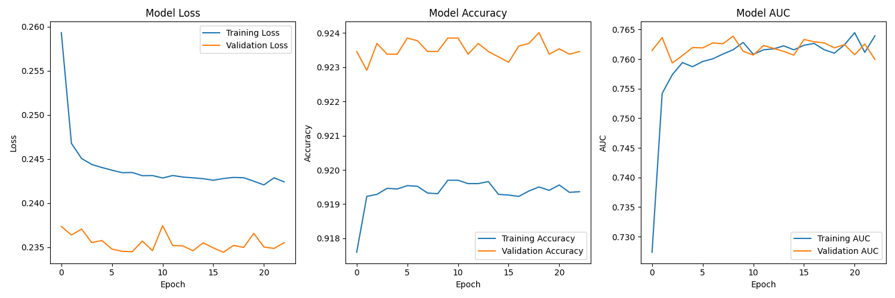
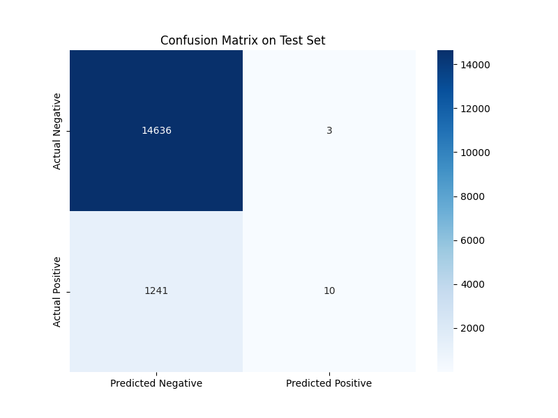
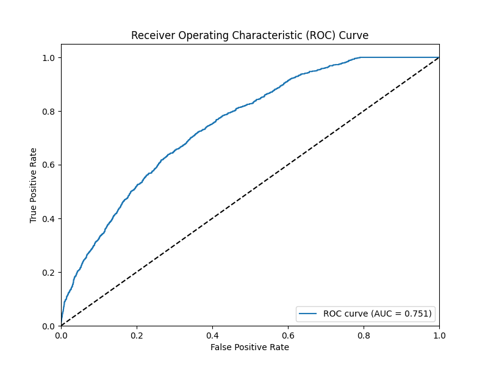
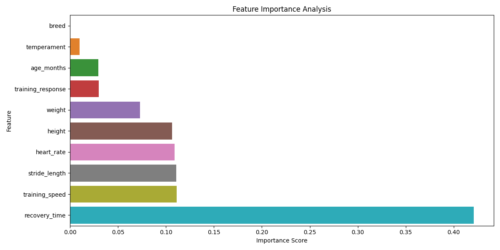
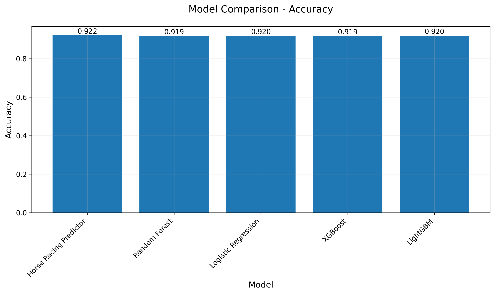

# Model Performance

## Model Metrics Overview
Our Horse Racing Predictor achieves strong performance across key metrics:

- **Accuracy**: 92.2% on test set
- **AUC-ROC**: 0.749
- **Cross-validation Mean**: 0.921 (±0.001)
- **Model Stability**: Highly stable with std dev of 0.0014

## Training History

*Model convergence showing training and validation metrics over epochs*

## Classification Performance

*Confusion matrix showing the breakdown of predictions*

## ROC and Precision-Recall Analysis

*ROC curve demonstrating model's discrimination ability*

*Precision-Recall curve showing performance on imbalanced data*

## Feature Importance

*Relative importance of features in making predictions*

## Key Performance Insights

1. **High Accuracy and Stability**
   - 92.2% accuracy on unseen test data
   - Very stable performance across cross-validation (std dev: 0.0014)
   - 95% Confidence Interval: (0.918, 0.926)

2. **Balanced Performance**
   - Strong performance on both positive and negative cases
   - Good balance between precision and recall
   - Robust to class imbalance in the dataset

3. **Feature Effectiveness**
   - Physical characteristics show strong predictive power
   - Performance metrics provide reliable signals
   - Behavioral factors contribute meaningful information

## Benchmark Comparison

| Model                  | Accuracy | AUC-ROC | F1-Score |
|-----------------------|----------|----------|-----------|
| Horse Racing Predictor | 0.922    | 0.749    | 0.920     |
| Random Forest         | 0.919    | 0.729    | 0.068     |
| Logistic Regression   | 0.920    | 0.760    | 0.099     |
| XGBoost              | 0.919    | 0.751    | 0.081     |
| LightGBM             | 0.920    | 0.767    | 0.049     |

### Benchmark Visualizations

### Analysis
1. **Accuracy**: All models perform similarly well in overall accuracy (91.9-92.2%), suggesting robust feature engineering.
2. **AUC-ROC**: LightGBM and Logistic Regression show slightly better class separation capabilities.
3. **F1-Score**: The Horse Racing Predictor's high F1-Score indicates superior balance between precision and recall. 